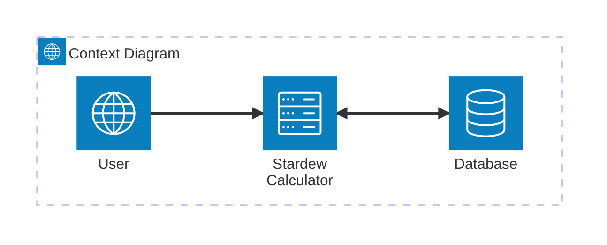
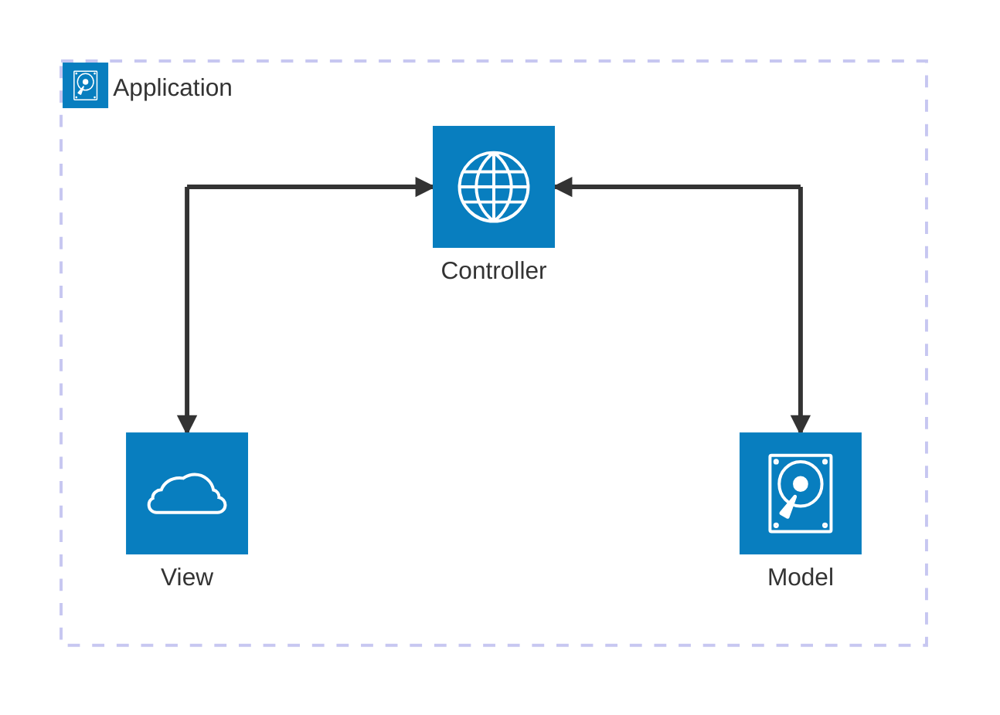

# StardewValleyCalculator

## Introduction
A web based calcualtor, written in C#, with stardew valley based paramaters. 

## Architecture Overview





## How to Use

You can run `make help` in the terminal to see the following useful commands for this project.
``` console
build                          Build a docker image
dev                            Run the project in watch mode, any file changes will be reflected at runtime
docker-run                     Run the latest build of the docker image
help                           Display this help
http                           Run the project in http mode
https                          Run the project in https mode
tests                          Run all the tests
```


### Prerequisites

TODO: Explain which steps and dependencies are required to run and build the project (e.g., pip install -r requirements.txt)

### Build

TODO: Explain how the whole project can be build.

### Test

TODO: Explain how unit- or integreation tests can be executed.

### Run

TODO: Explain how to run the project (client, server etc.).

## License

TODO: Add license and copyright notice.