# StardewValleyCalculator

## Introduction
A web based calcualtor, written in C#, with stardew valley based paramaters. 

## Architecture Overview (optional)

```mermaid
  info
``` 

```mermaid
architecture-beta
    group context[Context Diagram]
    service database(DB)[Database] in context
    service user(internet)[User] in context
    service stardew(server)[StardewValleyCalculator]

    user:R --> L:stardew
    database:L --> R:stardew
```



## How to Use

### Prerequisites

TODO: Explain which steps and dependencies are required to run and build the project (e.g., pip install -r requirements.txt)

### Build

TODO: Explain how the whole project can be build.

### Test

TODO: Explain how unit- or integreation tests can be executed.

### Run

TODO: Explain how to run the project (client, server etc.).

## License

TODO: Add license and copyright notice.